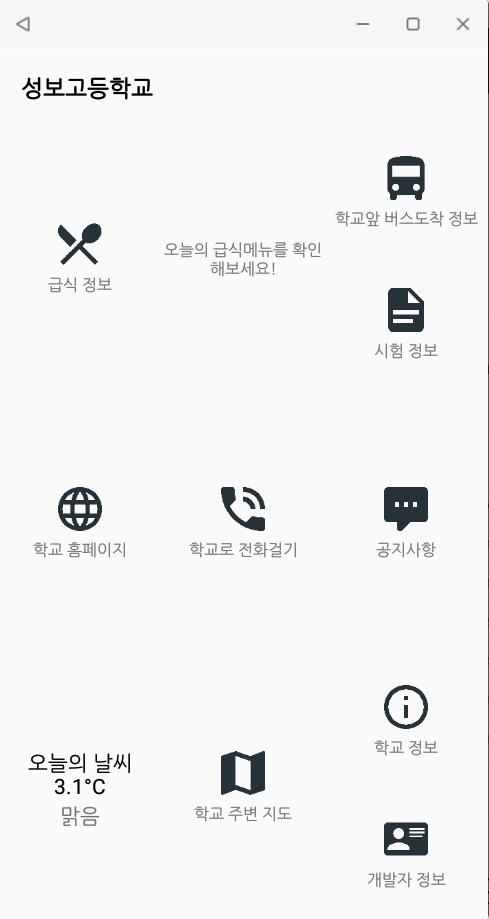
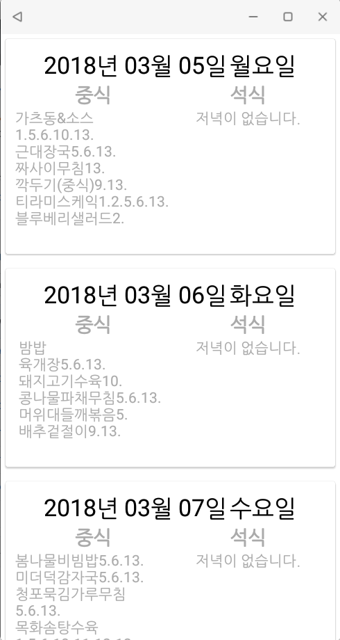
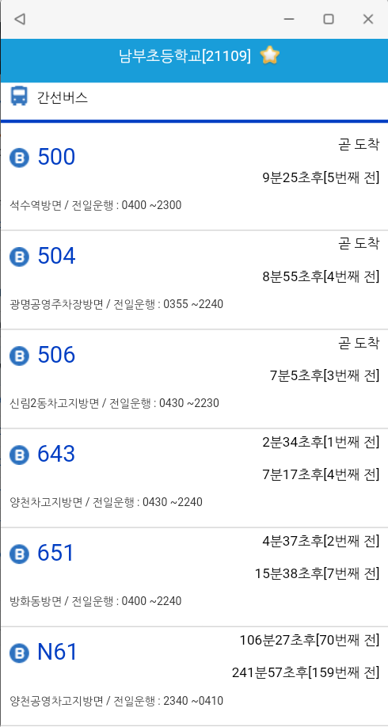
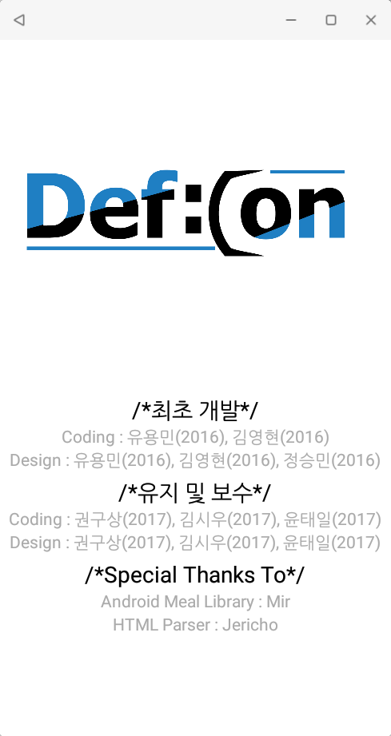

# 성보고등학교 애플리케이션
## 이 프로젝트는 종료되었으며, 다음 링크에서 새 버전을 확인해주세요.
## https://github.com/yymin1022/SungboHighSchool_New

## 스크린샷
### 메인화면

### 급식 메뉴 확인

### 학교 앞 버스 도착정보 확인

## 개발자 정보

### 최초 개발자
#### 코딩
유용민(2016), 김영현(2016)
#### 디자인
유용민(2016), 김영현(2016), 정승민(2016)
### 유지/보수
#### 코딩
유용민(2016), 김영현(2016)
#### 디자인
유용민(2016), 김영현(2016), 정승민(2016)
### 다운로드
#### https://play.google.com/store/apps/details?id=com.sungbospot.lunch
### Powered by DefCon(성보고등학교 프로그래밍 동아리)
